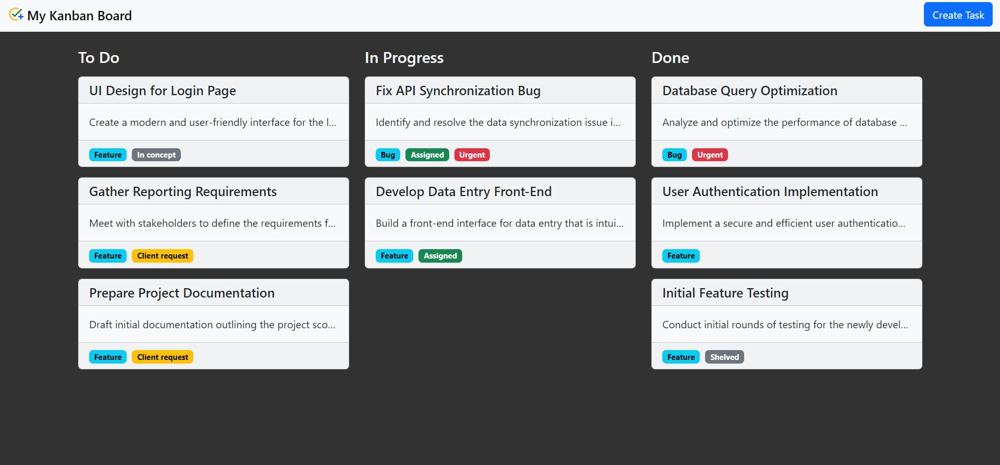
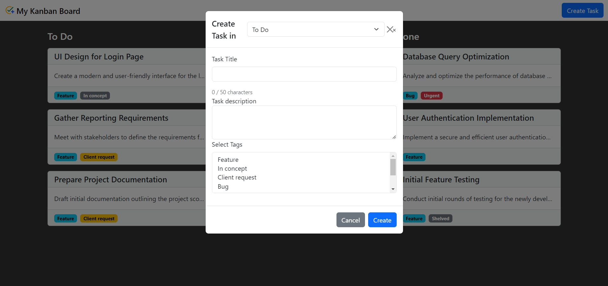

# vueapplication

This project is a learning exercise that combines Vue.js for the frontend and Node.js with Express for the backend. The frontend, developed with Vue.js, offers an interactive user interface, while the backend, powered by Node.js and Express, handles server logic and API integrations. Key features include:

### Vue.js Frontend:
Utilizes Vue.js for dynamic and interactive user interfaces, leveraging its component-based architecture and reactive data binding.
### Node.js with Express Backend: 
Employs Node.js with Express to handle server logic and API integrations, ensuring smooth communication between frontend and backend components.
### Responsive Design: 
Prioritizes responsiveness, ensuring seamless user experience across various devices, including desktops, tablets, and mobile phones.
This project serves as a platform to deepen understanding of Vue.js while simultaneously exploring backend development with Node.js and Express.

## Screenshots:

Homepage of the Web Application.

Adding a Task

## Starting : 
1. In the "frontend" folder, run npm install to set up dependencies for the Vue application.
2. In the "backend" folder, execute npm install to install dependencies for the Node.js server.
3. To start the Vue application, run npm run build in the "frontend" folder.
3. Start the Node.js server by running node index.js in the "backend" folder.

